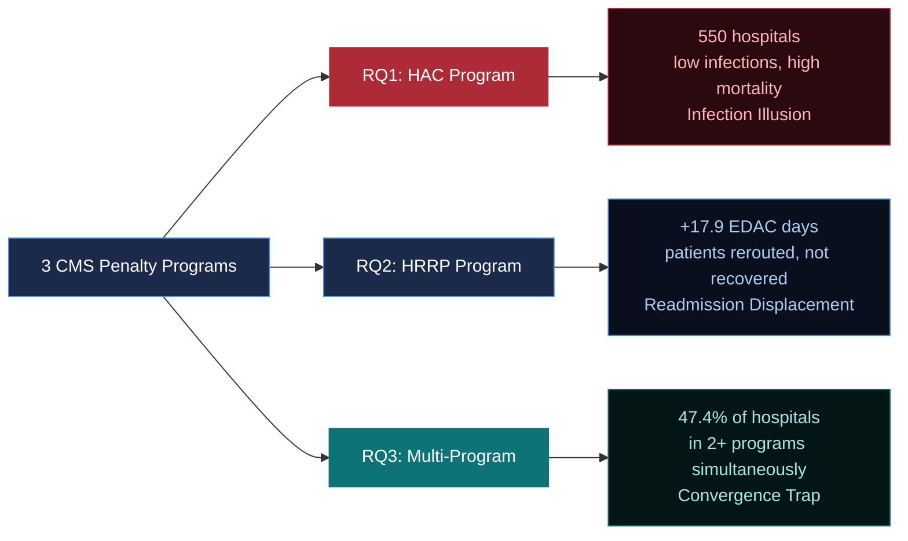
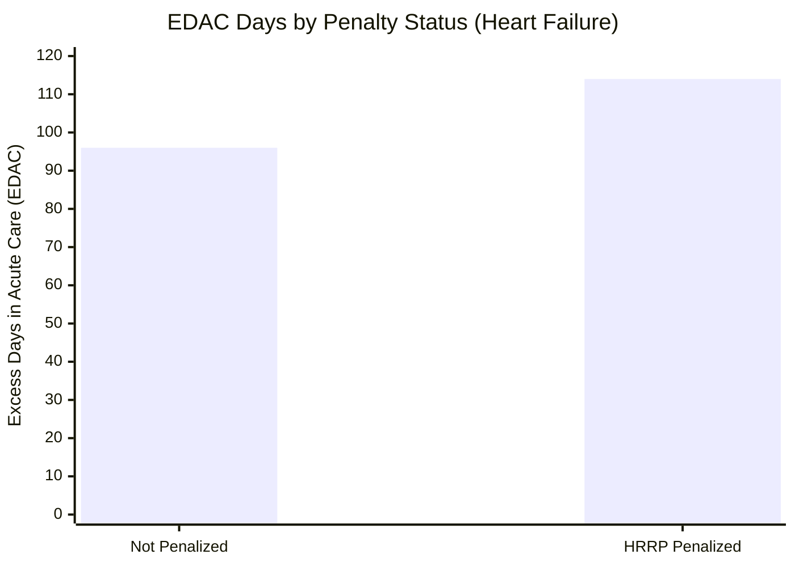
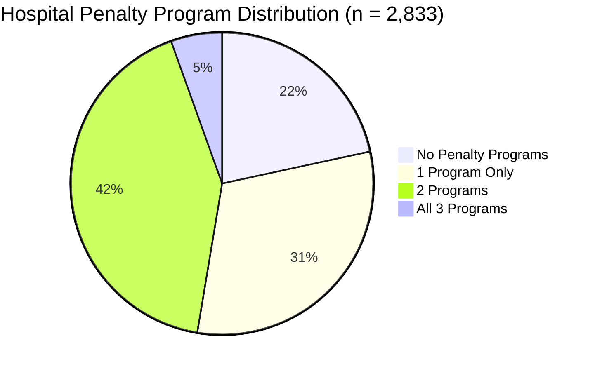
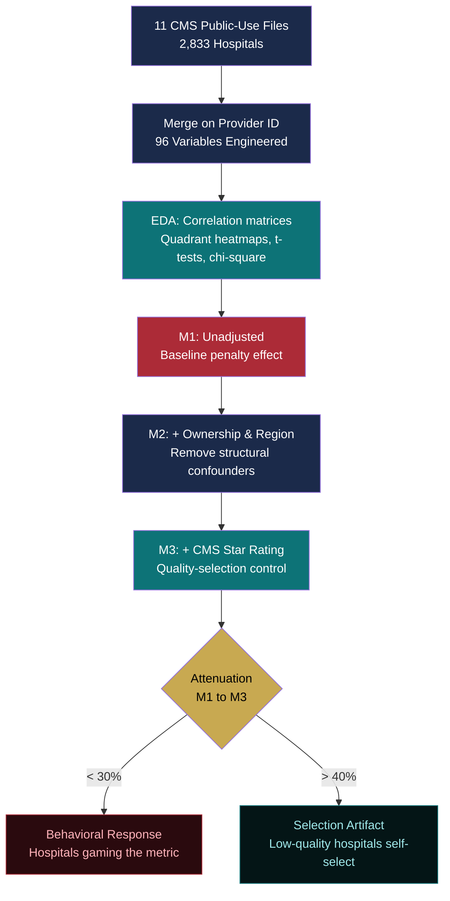

<div align="center">

# The Compliance Trap


**[View Live Site](https://ajayvarmaramineni.github.io/CMS-Compliance-Trap/)**

*When the score becomes the goal, the goal stops being care.*

</div>

---

## Overview

CMS operates three simultaneous penalty programs designed to drive hospital quality: HRRP (readmissions), HAC (hospital-acquired conditions), and VBP (value-based purchasing). Each was designed independently. This study tests whether they work together - or against each other.

Using cross-sectional OLS regression on 2,833 U.S. acute care hospitals across 11 merged CMS datasets, we find three distinct failure modes - one per program.

---

## Findings at a Glance



---

## RQ1 - The Infection Illusion (HAC Program)

> Hospitals can score well on infection metrics while posting above-median mortality. The HAC program's detection failure is non-random.

| Metric | Value |
|--------|-------|
| HAI - Mortality correlation | r = 0.015, p = 0.46 (not significant) |
| Variance explained in mortality | R² = 0.0002 |
| Blind-spot hospitals (low HAI, high mortality) | **550** |
| HAC detection rate of blind-spot hospitals | **9.8%** |
| Detection failure (chi-square) | χ² = 62.75, p < 0.001 |

```mermaid
quadrantChart
    title HAI Score vs Mortality Rate (n = 2,833)
    x-axis Low HAI Score --> High HAI Score
    y-axis Low Mortality --> High Mortality
    quadrant-1 High Risk, Penalized
    quadrant-2 High Risk, Not Penalized
    quadrant-3 Low Risk, Not Penalized
    quadrant-4 Low Risk, Penalized
    Blind Spot Hospitals: [0.22, 0.73] radius: 0.22
    Correctly Flagged: [0.72, 0.68] radius: 0.12
    Safe & Penalized: [0.75, 0.28] radius: 0.10
    Safe & Clear: [0.25, 0.28] radius: 0.18
```

<details>
<summary><b>Statistical specification</b></summary>

```
Model 1 (Unadjusted):   Mortality ~ HAI_Composite
Model 2 (+ Controls):   Mortality ~ HAI_Composite + Ownership + Region
Model 3 (+ Quality):    Mortality ~ HAI_Composite + Ownership + Region + CMS_Stars

SE: HC3 heteroskedasticity-robust throughout
Blind-spot defined as: HAI_score < median AND mortality > median
Detection failure: chi-square test on HAC penalty status across quadrants
```

</details>

---

## RQ2 - Readmission Displacement (HRRP Program)

> HRRP-penalized hospitals post better 30-day readmission numbers - but show a persistent EDAC gap. Attenuation analysis identifies this as behavioral response, not selection bias.

| Metric | Value |
|--------|-------|
| EDAC gap (heart failure) | **+17.9 days** per penalized hospital |
| M1 to M3 attenuation | **22.5%** - behavioral signal confirmed |
| SNF discharge share (non-penalized) | 39.0% vs 38.0% |
| Statistical significance | p < 0.001 |



<details>
<summary><b>Three-model attenuation framework</b></summary>

```
M1 (Unadjusted):  EDAC ~ HRRP_Penalty
                  Coefficient: β = 20.1***

M2 (+ Ownership/Region):  EDAC ~ HRRP_Penalty + Ownership + Region
                          Coefficient: β = 18.4***

M3 (+ CMS Stars):  EDAC ~ HRRP_Penalty + Ownership + Region + CMS_Stars
                   Coefficient: β = 15.6***

Attenuation M1 to M3: (20.1 - 15.6) / 20.1 = 22.5%
Interpretation: <30% attenuation = behavioral response, not selection artifact
```

</details>

---

## RQ3 - Multi-Program Convergence

> Nearly half of U.S. hospitals face 2+ simultaneous penalty programs. Each additional program predicts measurably worse outcomes across every quality dimension.

| Metric | Value |
|--------|-------|
| Hospitals in 2+ programs | **47.4%** (1,342 hospitals) |
| Hospitals in all 3 programs | **155** |
| HCAHPS per additional penalty | -1.41 pts (p < 0.001) |
| CMS Stars per additional penalty | -0.48 stars (p < 0.001) |
| PSI-90 per additional penalty | +0.065 composite (p < 0.001) |
| Convergent hospitals in the South | **56.8%** |



<details>
<summary><b>Regression specifications (RQ3)</b></summary>

```
HCAHPS   ~ N_Programs + Ownership + Region + CMS_Stars   beta = -1.41***
CMS_Stars ~ N_Programs + Ownership + Region              beta = -0.48***
PSI-90   ~ N_Programs + Ownership + Region + CMS_Stars   beta = +0.065***

N_Programs: count of HRRP + HAC + VBP penalties (0-3)
All models: HC3 robust SE, hospital-level cross-section, FY2026
```

</details>

---

## Analytical Framework



---

## Policy Recommendations

<details>
<summary><b>1. Co-monitor mortality alongside HAI metrics (HAC reform)</b></summary>

HAC compliance should require low HAI scores AND mortality within expected range. Hospitals meeting the infection threshold but posting above-median mortality should be flagged regardless of penalty status. Zero implementation cost - uses existing CMS data.

</details>

<details>
<summary><b>2. Make EDAC a co-primary HRRP metric (HRRP reform)</b></summary>

Weight EDAC at 50% of the readmission score. This eliminates the financial incentive to discharge patients to SNFs to game the 30-day window - the core displacement mechanism documented in RQ2. EDAC data already exists in CMS datasets.

</details>

<details>
<summary><b>3. Cap penalties for convergent hospitals (multi-program reform)</b></summary>

Hospitals in 2+ concurrent programs should face a penalty cap. A portion of penalty revenue redirected as improvement grants targeting the 155 convergent hospitals - 56.8% of which are in the South, disproportionately serving Medicaid populations.

</details>

---

## Repository Structure

```
CMS-Compliance-Trap/
├── index.html                   # Interactive research site (self-contained)
├── assets/
│   └── poster/                  # BUS596 conference poster (PDF)
├── charts/
│   ├── rq1_chart.png            # HAI vs. mortality quadrant
│   ├── rq2_chart.png            # EDAC displacement
│   └── rq3_chart.png            # Multi-program convergence
└── images/
    └── WPI-logo.png
```

---

## Stack

| Layer | Tool |
|-------|------|
| Analysis | Python 3.11 (pandas, numpy, scipy) |
| Regression | statsmodels OLS with HC3 robust SE |
| Visualization | matplotlib, seaborn (static charts) |
| Interactive site | Vanilla HTML / CSS / JS, Chart.js |
| Data | 11 CMS Hospital Quality Reporting public-use files |
| Poster | PowerPoint (36x28 in print-ready) |

---

<div align="center">

**WPI BUS596 Healthcare Analytics Capstone - Spring 2026**

Ajay Varma Ramineni - Worcester Polytechnic Institute

*Applying Goodhart's Law to healthcare measurement: when a measure becomes a target, it ceases to be a good measure.*

</div>
